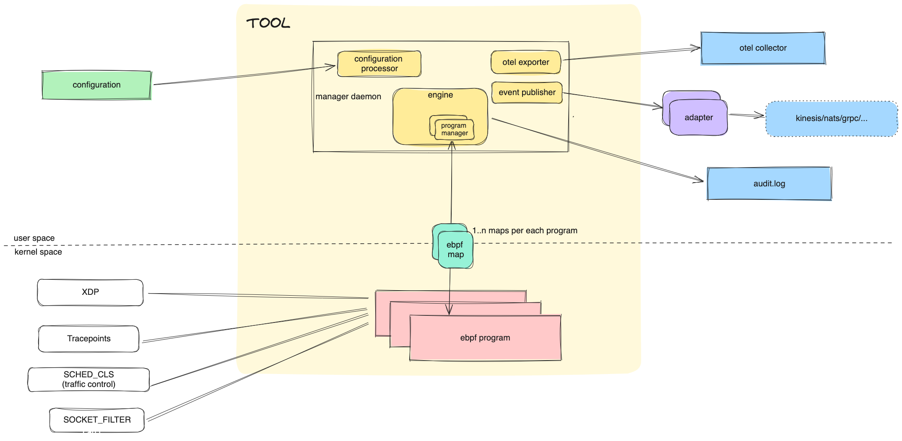

# Introduction
This design document presents an overview of the system, outlining its architecture, capabilities, and technical implementation details. The TOOL system is designed to offer users the ability to detect and prevent unknown network connections, thereby enhancing the security posture of their systems.

By leveraging the power of eBPF, the TOOL system provides granular control over network traffic, allowing users to define custom rules for filtering connections based on various criteria. 

the TOOL system runs in "detect" mode for passive monitoring or "prevent" mode for proactive blocking against unauthorized access and malicious activities.

# Requirements analysis
- two modes
    - detect mode
        - understand and inspect the network behavior 
    - prevent mode
        - enforce configured rules by blockicg unknown/unwanted network traffic
- UX
    - input
        - easy and encoruaging to write and read
        - config syntax should be easy to validate with schema 
        - in widely acknowledged format
            - yaml (incl. json) + jsonschema
            - cuelang maybe?
            - not xml :)
    - output
        - otel integration for
            - traces
            - metrics
            - log 
        - audit.log accessible for priviledged user only
            - human readable log records
            - no need to be parse-friendly becasue otel logs can be used for that
        - expose API
        - allow 3rd party software to subscribe for events from us
    - should allow users effectivly configure the system against potential threats
    - reasonable defaults
    - documented features with examples
    - playground/online editor like [editor.networkpolicy.io](editor.networkpolicy.io)
- security
    - only priviledged user can access audit.log or daemon configuration
- error handling
    - user decides what to do with errors
    - drop packets by default?
- scalability
    - should be able to handle high traffic
    - should be able to handle high number of rules

# System overview

TOOL leverages ebpf therefore it's split into two parts - user space and kernel space.

## User space
Daemon running in userspace is responsible for ebpf programs orchestration and integration with OS, user and 3rd party software.

### Configuration processor
Module responsible for processing the configuration.
It creates rules for the engine and provides configuration to other modules.

### Engine
The Engine manages the execution of ebpf programs, taking its input from rules established by the Configuration Processor.

The TOOL includes ebpf program templates. These templates are populated with specific values derived from the rules, after which they are compiled and loaded into the kernel.

❗ ADD EXAMPLE SOURCE CODE HERE

### otel exporter
OpenTelemetry exporter is responsible for exporting traces, metrics and logs to the OpenTelemetry collector.
 
### event publisher
Event publisher is responsible allowing 3rd party software to subscribe for events from us. Event subscriber can be any software that can consume events from us, so user is responsible for providing an adapter for that software.

## Kernel space - ebpf programs
Ebpf programs are loaded to kernel and are responsible for tracking and filtering network traffic.

## Communication between kernel and user space
Communication between kernel and user space is done via bpf maps.
Map type and data structure is ebpf-program specific.

# Feature capabalities
The issue we aim to address is the identification and blocking of undesired network connections. In this context, we define a network connection as a L3 connection between hosts in an IPv4 or IPv6 network.

We will primarily concentrate on the most frequently used L4 protocols, which include TCP, UDP, and ICMP. Additionally, we will consider L7 protocols such as HTTP, HTTPS, DNS, SSH, and others.

Following is a list of features that the TOOL system will support for filtering network connections:

## L3
    - IP filtering
    - IP ranges

## L4
### TCP
    - Port ranges
    - Connection duration
### UDP
    - Port ranges
### ICMP
    - ICMP types
    - ICMP codes

## L7
### HTTP
    - Domain
    - Asterisk for domains
    - Subdomains
    - Path
    - HTTP methods
    - HTTP headers
    - Protocol version
### HTTPS
    - CA filtering
    - TLS version

### DNS
    - Domain
    - enforce DNS over TLS

### SSH
    - incomming connections filtering by IP or public key
    - outgoing connections filtering by IP (IP range) or hostname

### Other
    - anomalies detection based on previous traffic
    - profiling, statistics

# Technical implementation details

# Limitation and Constraints

# Testing and validdation

# Conclusion